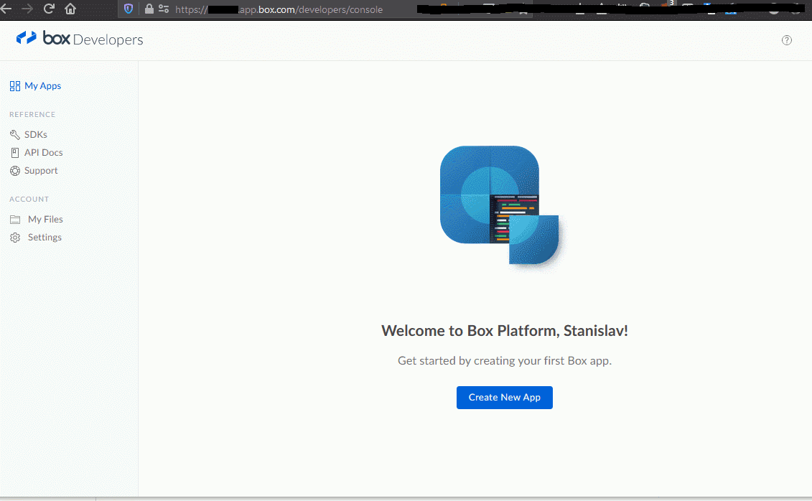

# box-simple-download
Download files from box.com given shared URL and file list.

The purpose of the script is to get Box shared url, file list and destination directory from Jira ticket's description, and download the files using Box SDK.

Example of the Jira ticket's description:
>Hello,
>
>Please upload the following files to the server:
>
>somefile1.zip \
>anotherfile.ZIP \
>somefile2.txt
>
>
>The files are available at the following Box link: https://somename.box.com/s/7ei54ueq1234567o7uisp6kyq7654321
>
>The target is \\\\someserver\\share\\folder1\\folder2
>
>Thank you
## Configuration
#### Install required modules
```shell script
pip install -r requirements.txt
```
#### Get Box credentials
Go to **https://\<somename>.app.box.com/developers/console/** and follow the instructions below


#### Edit config.yml
```shell script
cp config.yml.example config.yml
```
Then replace config values with your own.
## Usage
Get developer token from the Box app you just created (it expires every hour)
Then run the script
```shell script
python box_simple_download.py <jira ticket> <developer token>
```
Example:
```shell script
python box_simple_download.py ABC-12345 XBvK7s1fI77gbsLdcDHeyJBx1azAFo9N
```
